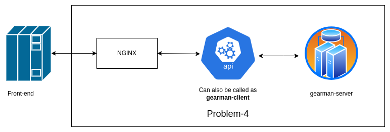

## Riskthinking.ai- Data Engineer Assignment

------------

#### This project contains code, as an assignment, completed as a part of the hiring process of RiskThinking.ai organization

Details of the assignemnt questions can be viewed from the [Data-Engineer.md](https://github.com/Chanpreet-Singh/riskthining-ai-assignment/blob/main/Data-Engineer.md "Data-Engineer.md") file

Development environment:
- [Debian/Ubuntu 20.04 LTS](https://releases.ubuntu.com/focal/ "Debian/Ubuntu 20.04 LTS")
- [Python 3.8](https://www.python.org/downloads/release/python-380/ "Python 3.8")
- [Spark 3.4.0](https://spark.apache.org/releases/spark-release-3-4-0.html "Spark 3.4.0")
- [Prefect orchestration tool](https://www.prefect.io/ "Prefect orchestration tool")
- [Fast API Service](https://fastapi.tiangolo.com/ "Fast API Service"), [Gearman Job Server](http://gearman.org/ "Gearman Job Server") and [NGINX](https://www.nginx.com/ "NGINX") - for API building and model deployment

Before proceeding, the data should be downloaded(from the URL  given in the assignment) and extracted into a folder named 'archive'. Since, problem-4 is not dockerized, make sure to create a python virtual environment as venv and install all the dependencies mentioned in [requirements.txt](https://github.com/Chanpreet-Singh/riskthining-ai-assignment/blob/main/requirements.txt "requirements.txt") file

------------
##### Solution of Problem-1
Problem-1 is divided into 2 sub-tasks, let it be named 'a' and 'b'
- **Part-a** is executed using python using multiprocessing, by leveraging all the cores of the machine, in a distributed manner. Tasks carried out in part-a creates reads every csv file, maps the *Symbol* and *Security Name* using metadata and the each data's file name. Then each file is dumped as csv into *semi-processed* folder following the same directory structure as the input folder - *archive*.   Script Name - [problem-1-a.py](https://github.com/Chanpreet-Singh/riskthining-ai-assignment/blob/main/problem-1-a.py "problem-1-a.py")
- **Part-b** is executed using Spark(Pyspark) wherein all the csv files are read from the *semi-processed* folder (both etfs and stocks), then merged into a single dataframe and dumped as a parquet file. Script Name - [problem-1-b.py](https://github.com/Chanpreet-Singh/riskthining-ai-assignment/blob/main/problem-1-b.py "problem-1-b.py")

------------
##### Solution of Problem-2
Problem-2 is solved using Spark(Pyspark) wherein the parquet file is read, the entire dataset in windowed on the basis of *Symbol* we mapped in problem-1(part-a) and each window is ordered on the basis of *Date* feature. In each window, *vol_moving_avg* (30-day moving average) and *adj_close_rolling_med* (30-day moving median) is calculated. All the columns in the resulting dataframe except *vol_moving_avg*, *adj_close_rolling_med*, *Volume* are removed. The final data is dumped into the folder *model* again as a parquet file. Script Name - [problem-2.py](https://github.com/Chanpreet-Singh/riskthining-ai-assignment/blob/main/problem-2.py "problem-2.py")

------------
##### Solution of Problem-3
This problem is solved using python script wherein [RandomForestRegressor](https://scikit-learn.org/stable/modules/generated/sklearn.ensemble.RandomForestRegressor.html "RandomForestRegressor") algorithm is applied on the data. Since, it is a memory intensive process, a random sampling(10%) was done on the data and then the algorithm was applied using one-fourth of the processors in the machine. The resultant model is dumped as a [pickle](https://docs.python.org/3/library/pickle.html "pickle") file. This pickle file will be used for giving out results via Rest API. Script Name - [problem-3.py](https://github.com/Chanpreet-Singh/riskthining-ai-assignment/blob/main/problem-3.py "problem-3.py")

------------
**All the above 4 scripts are sequentially executed using Prefect orchestrating tool inside a containerized environment.**
 
The orchestrating is done in a sequential manner of different tasks as a single flow, problem-1a -> problem-1b -> problem-2 -> problem-3 in such a way - if a task fails the subsequent tasks are not executed. It is done to make fault-detection easy.
 
The orchestration is maintained in [master.py](https://github.com/Chanpreet-Singh/riskthining-ai-assignment/blob/main/master.py "master.py")  
Steps to execute: 
`docker build -t my_flow .` this command will create an image named *my_flow*  
`docker run -v .:/app my_flow` this command will execute the image  

------------
##### Solution of Problem-4
This problem is solved in three parts:
- **Rest API**: The API is built using Fast API. Script name: [problem-4-api.py](https://github.com/Chanpreet-Singh/riskthining-ai-assignment/blob/main/problem-4-api.py "problem-4-api.py").  Command to execute: `source venv/bin/activate; uvicorn problem-4-api:app`
- **Nginx Load balancer** - for interacting with requests coming from outside VM.  Script and Command to setup nginx - `cd nginx-deploy-commands/ && bash setup_nginx.sh` 
Note: This step is optional and might be required for production systems.
- **Gearman Job Server** - for keeping the model always alive in RAM i.e. making the model readily available. It is chosen because the resultant model(despite training on just 10% of the data, refer problem-3) is atleast 3.5GB in size. Thus, loading such a huge model at each request would be not only processor intensive but memory intensive too in case of high concurrent requests.  
Script name: [problem-4-model_loader.py](https://github.com/Chanpreet-Singh/riskthining-ai-assignment/blob/main/problem-4-model_loader.py "problem-4-model_loader.py") 
Command to execute: `source venv/bin/activate; python problem-4-model_loader.py` 
Note: A check has been applied in the API Service that without spinning up the gearman worker of the model, it won't execute.

------------
##### **Testing the API**
The API is deployed in an AWS EC2 instance using the above architecture. 
To test the API, you can use the script [test_api.py](https://github.com/Chanpreet-Singh/riskthining-ai-assignment/blob/main/test_api.py "test_api.py") 
Command to execute: `python test_api.py`

It can also be tested using other clients like cURL, [Java](https://rapidapi.com/guides/make-api-call-java "Java"), etc 
cURL ommand to execute(in Shell): `curl --location 'http://18.219.86.19/predict?vol_moving_avg=12121&adj_close_rolling_med=23'`

Updated the testing part:
Since the hosted URL was non-economical for me and there was delay in the evaluation, I decided to terminate the hosted instance and provided a python notebook in which a lot of test cases are shown as testing of the API. Please review [Riskthinking-ai-API-testing.ipynb](https://github.com/Chanpreet-Singh/riskthining-ai-assignment/blob/main/Riskthinking-ai-API-testing.ipynb) for the same.

------------
##### References
I took help from a few sources:
 - **Prefect**: https://www.youtube.com/playlist?list=PLZfWmQS5hVzFmPh4hVj9ijtl-jRhsWD6E
 - **Chat GPT**: https://chat.openai.com/ (Pardon me for this- I could not maintain the history) The code I majorly referred to was Windowing functions/operations in a pyspark dataframe 
 - **Read parquet in pandas**: https://pandas.pydata.org/docs/reference/api/pandas.read_parquet.html
 - **Python multiprocessing tutorial**: https://www.digitalocean.com/community/tutorials/python-multiprocessing-example
 - There was an instance during development where accidentally I messed up my python and eventually the whole OS, referred to this to repair them: https://askubuntu.com/questions/1428181/module-lib-has-no-attribute-x509-v-flag-cb-issuer-check/1433089#1433089
 - **Missed proxy_pass** configuration during NGINX setup: https://stackoverflow.com/questions/31859456/cant-access-nginx-server-from-outside
- **Gearman**: http://gearman.org/documentation/
